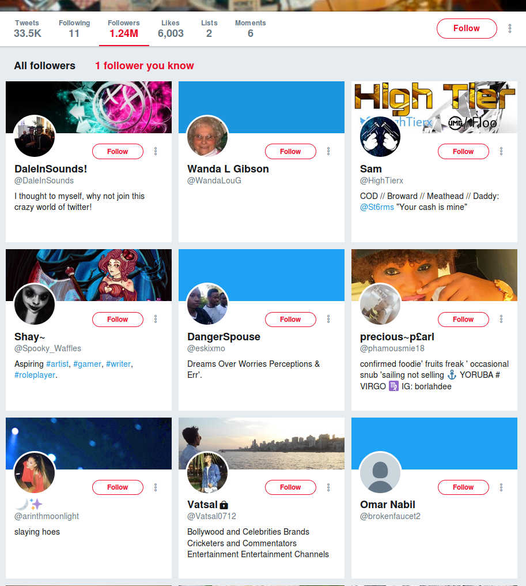
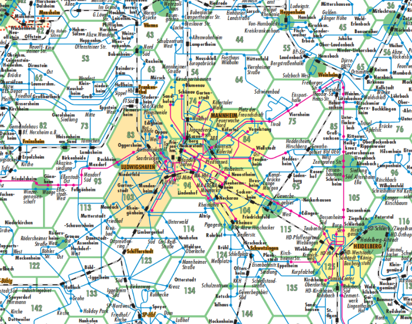

## Who am I?

Chung-hong Chan

twitter / github: @[chainsawriot](https://github.com/chainsawriot) 

Maintainer:

- [ngramrr](https://cran.r-project.org/web/packages/ngramrr/index.html), [readODS](https://cran.r-project.org/web/packages/readODS/index.html)

Author:

- [rio](https://cran.r-project.org/web/packages/rio/), [SocialMediaLab](https://cran.r-project.org/web/packages/SocialMediaLab/)

## Social Network Analysis

*Social Network* Analysis

## Graph

- G = (V, E)

## Example


## Definitions of V and E


- **V**ertices (entities): Länder
- **E**dges (relationships): Share borders

## Representation


- **V**ertices = {BW, BY, RP, HE, SL, NW....}
- **E**dges = {{BW, BY}, {BW, RP}, {BW, HE}, {HE, NW}, ...}

## Representation

```{r germany_el, echo = FALSE, message = FALSE}
require(igraph)
germany <- read.csv('germany_map.csv')
knitr::kable(head(germany), caption = "Edgelist")
```

## Visualization

```{r germany_graph, echo = FALSE, message = FALSE}
g <- igraph::simplify(graph.data.frame(germany, directed = FALSE))
plot(g)
```

## Vertice size by no of degrees

```{r germany_graph_degree_centrality, echo = FALSE, message = FALSE}
plot(g, vertex.size = degree(g) * 3)
```

## igraph

```{r germany_code, eval = FALSE}
require(igraph)
germany <- read.csv('germany_map.csv')
g <- igraph::simplify(graph.data.frame(germany, directed = FALSE))
plot(g, vertex.size = degree(g) * 3)
```

## Terminology

```{r terminology, echo = FALSE , message = FALSE}
knitr::kable(data.frame(crowd = c("Mathematicians", "Computer Scientists", "Social Scientists", "Most People (me included)", "Some People"), V = c("Vertices", "Nodes", "Actors", "Nodes", "Points"), E = c("Edges", "Arcs, Edges", "Ties", "Edges", "Lines")))
```

## Directed graph

Germany example: undirected, always with reciprocal edges

directed: edges are not always reciprocal.

## Twitter


## Twitter: Followers



## Twitter: Following / followees


## Representation

```{r kfc, echo = FALSE , message = FALSE}
knitr::kable(data.frame(from = c('chainsawriot', 'whoever', 'kfc', 'kfc', 'kfc', 'kfc', 'kfc'), to = c('kfc', 'kfc', 'gerihalliwell', 'officialmelb','emmabunton','melaniecmusic','victoriabeckham')), caption = "Edgelist")
```

## Other directed graph examples

- Retweet/sharing network
- Citation network

## Weighted network

Both node and edge can be weighted.

## Example: RNV



## Presentation

```{r rnv, echo = FALSE , message = FALSE}
knitr::kable(data.frame(from = c('Mannheim', 'Mannheim', 'Ludwigshanfen'), to = c('Ludwigshanfen', 'Heidelberg', 'Heidelberg'), value = c(1, 3, 4)), caption = "Edgelist")
```

## Tie strength: the strength of weak ties


