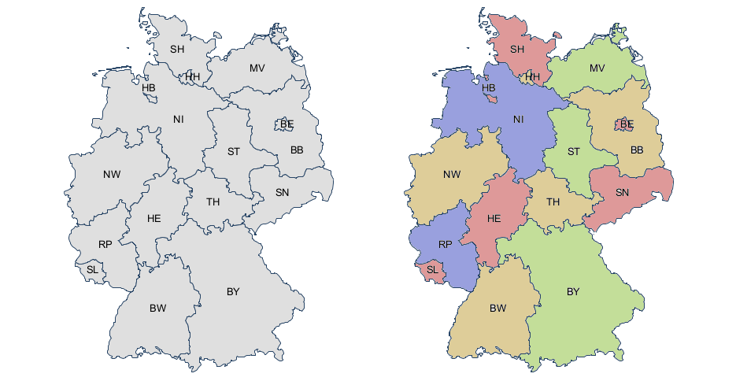
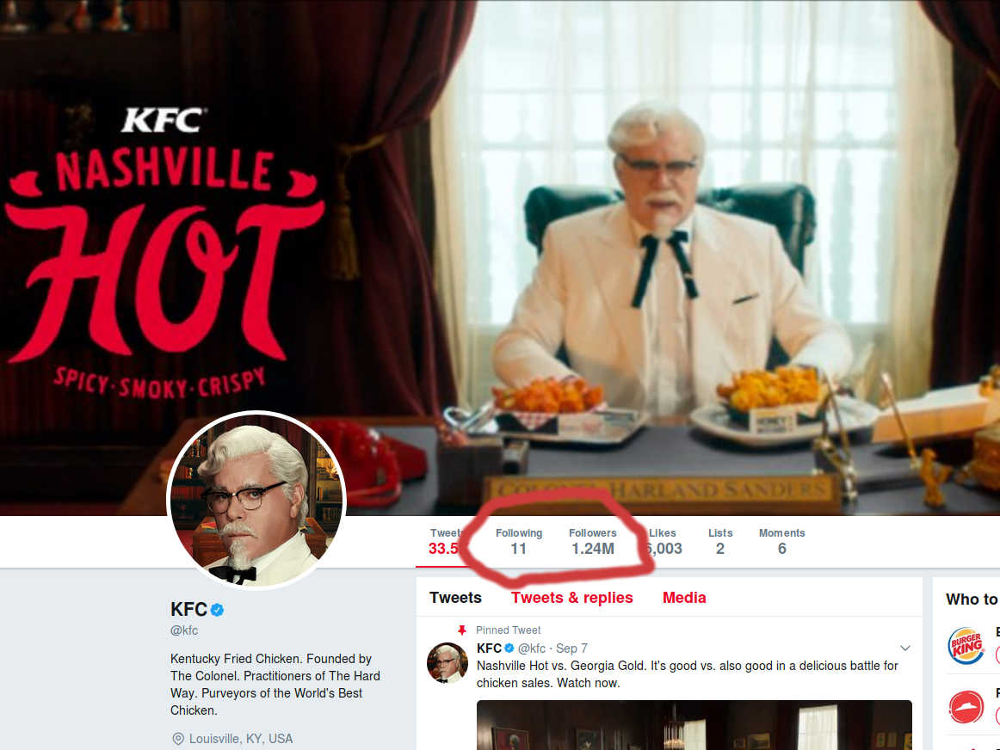
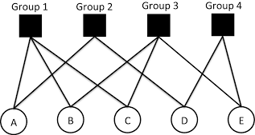
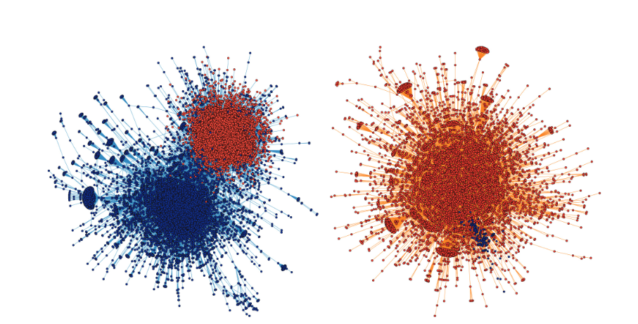

# Front matters

## whoami

Chung-hong Chan

twitter / github: @[chainsawriot](https://github.com/chainsawriot) 

Maintainer:

- [ngramrr](https://cran.r-project.org/web/packages/ngramrr/index.html), [readODS](https://cran.r-project.org/web/packages/readODS/index.html)

Author:

- [rio](https://cran.r-project.org/web/packages/rio/), [SocialMediaLab](https://cran.r-project.org/web/packages/SocialMediaLab/)

## Agenda

1. Social Network
      - Representation
      - Data collection
2. Analysis
      - node, edge, graph
3. igraph
      - example: MZES collabration network

# Social Network / Graph

## Graph

- G = (V, E)

## Example



## Definitions of V and E


- **V**ertices (entities): Länder
- **E**dges (relationships): Share borders

## Representation


- **V**ertices = {BW, BY, RP, HE, SL, NW....}
- **E**dges = {{BW, BY}, {BW, RP}, {BW, HE}, {HE, NW}, ...}

## Representation

```{r germany_el, echo = FALSE, message = FALSE}
require(igraph)
germany <- read.csv('germany_map.csv')
knitr::kable(head(germany), caption = "Edgelist")
```

## Visualization

```{r germany_graph, echo = FALSE, message = FALSE}
g <- igraph::simplify(graph.data.frame(germany, directed = FALSE))
plot(g)
```

## Vertice size by no of degrees

```{r germany_graph_degree_centrality, echo = FALSE, message = FALSE}
plot(g, vertex.size = degree(g) * 3)
```

## igraph

```{r germany_code, eval = FALSE}
require(igraph)
germany <- read.csv('germany_map.csv')
g <- igraph::simplify(graph.data.frame(germany, directed = FALSE))
plot(g, vertex.size = degree(g) * 3)
```

## Terminology

```{r terminology, echo = FALSE , message = FALSE}
knitr::kable(data.frame(crowd = c("Mathematicians", "Computer Scientists", "Social Scientists", "Most People (me included)", "Some People"), V = c("Vertices", "Nodes", "Actors", "Nodes", "Points"), E = c("Edges", "Arcs, Edges", "Ties", "Edges", "Lines")))
```

## Directed graph

**undirected**: always with reciprocal edges

**directed**: edges are not always reciprocal.

## Twitter

[kfc's Twitter](http://twitter.com/kfc)



## Representation

```{r kfc, echo = FALSE , message = FALSE}
knitr::kable(data.frame(from = c('chainsawriot', 'kfc', 'kfc', 'kfc', 'kfc', 'kfc'), to = c('kfc', 'gerihalliwell', 'officialmelb','emmabunton','melaniecmusic','victoriabeckham')), caption = "Edgelist")
```

## Other directed graph examples

- Retweet/sharing network
- Citation network

## Weighted network

Both node and edge can be weighted.

## Representation

```{r rnv, echo = FALSE , message = FALSE}
knitr::kable(data.frame(from = c('Mannheim', 'Mannheim', 'Ludwigshanfen', 'Mannheim'), to = c('Ludwigshanfen', 'Heidelberg', 'Heidelberg', 'Frankfurt'), distance = c(2.9, 20.3, 22, 76.7)), caption = "Edgelist")
```

## Representation

1. edgelist
2. adjaceny matrix

Edgelist is the adjacency matrix in triplet format(i,j,k).

## Example

```{r rnv2, echo = FALSE , message = FALSE}
knitr::kable(data.frame(from = c('Mannheim', 'Mannheim', 'Ludwigshanfen', 'Mannheim', 'Ludwigshanfen', 'Heidelberg'), to = c('Ludwigshanfen', 'Heidelberg', 'Heidelberg', 'Frankfurt', 'Frankfurt', 'Frankfurt'), distance = c(2.9, 20.3, 22, 76.7, 78.8, 84.3)), caption = "Edgelist")
```

## Adj. matrix

```{r adj1, echo = FALSE, message = FALSE}
knitr::kable(matrix(c(0, 2.9, 20.3, 76.7, 2.9, 0, 22, 78.8, 20.3, 22, 0, 84.3, 76.7, 78.8, 84.3, 0), nrow = 4, ncol = 4, byrow= TRUE, dimnames=list(c('Mannheim', 'Ludwigshafen', 'Heidelberg', 'Frankfurt'), c('Mannheim', 'Ludwigshafen', 'Heidelberg', 'Frankfurt'))))
```

## Edgelist

```{r kfc2, echo = FALSE , message = FALSE}
knitr::kable(data.frame(from = c('chainsawriot', 'kfc', 'kfc', 'kfc', 'kfc', 'kfc'), to = c('kfc', 'gerihalliwell', 'officialmelb','emmabunton','melaniecmusic','victoriabeckham')), caption = "Edgelist")
```

## adj. matrix

```{r adj2, echo = FALSE, message = FALSE}
knitr::kable(matrix(c(0, 1, 0, 0, 0, 0, 0,
         0, 0, 1, 1, 1, 1, 1,
         0, 0, 0, 0, 0, 0, 0,
         0, 0, 0, 0, 0, 0, 0,
         0, 0, 0, 0, 0, 0, 0,
         0, 0, 0, 0, 0, 0, 0,
         0, 0, 0, 0, 0, 0, 0),nrow = 7, ncol = 7, byrow= TRUE, dimnames=list(c('me', 'kfc', 'geri', 'melb', 'emma', 'melc', 'vic'),c('me', 'kfc', 'geri', 'melb', 'emma', 'melc', 'vic'))))
```

# Data collection

## Usual patterns

1. Ego network
2. Affiliation/bipartite network

## Ego network

From an ego, ask for alters.

```{r ego1, echo = FALSE, message = FALSE}
ego1 <- graph.data.frame(data.frame(ego = c('Hong', 'Hong', 'Hong'), alters = c('Elke', 'Hartmut', 'Julian')), directed = TRUE)
plot(ego1)
```

## Affiliation/bipartite network



## Example


## Representation

```{r, echo = FALSE, message = FALSE}
knitr::kable(data.frame(author = c('Jäger', 'Stecker', 'Däubler', 'Scholten', 'Tieben', 'Braun', 'Popa', 'Theocharis', 'van Deth', 'Benoit'), paper = c('1', '2', '2,6', '3', '3', '4', '4', '5', '5', '6')))
```

## Normalization: 3NF

```{r, echo = FALSE, message = FALSE}
knitr::kable(data.frame(author = c('Jäger', 'Stecker', 'Däubler', 'Scholten', 'Tieben', 'Braun', 'Popa', 'Theocharis', 'van Deth', 'Däubler','Benoit'), paper = c('1', '2', '2', '3', '3', '4', '4', '5', '5', '6','6')))
```

## Affiliation Matrix

```{r, echo = FALSE, message = FALSE}
knitr::kable(matrix(c(1,0,0,0,0,0,
         0,1,0,0,0,0,
         0,1,0,0,0,1,
         0,0,1,0,0,0,
         0,0,1,0,0,0,
         0,0,0,1,0,0,
         0,0,0,1,0,0,
         0,0,0,0,1,0,
         0,0,0,0,1,0,
         0,0,0,0,0,1), nrow = 10, byrow = TRUE, dimnames = list(c('Jäger', 'Stecker', 'Däubler', 'Scholten', 'Tieben', 'Braun', 'Popa', 'Theocharis', 'van Deth','Benoit'), c('P1', "P2", "P3", "P4", "P5", "P6"))))
```

## R internal

```{r, echo = TRUE, eval = FALSE}
matrix(c(1,0,0,0,0,0,
         0,1,0,0,0,0,
         0,1,0,0,0,1,
         0,0,1,0,0,0,
         0,0,1,0,0,0,
         0,0,0,1,0,0,
         0,0,0,1,0,0,
         0,0,0,0,1,0,
         0,0,0,0,1,0,
         0,0,0,0,0,1), nrow = 10, 
		 byrow = TRUE, 
		 dimnames = list(
		 c('Jäger', 'Stecker', 'Däubler', 'Scholten', 
		 'Tieben', 'Braun', 'Popa', 'Theocharis', 
		 'van Deth','Benoit'), 
		 c('P1', "P2", "P3", "P4", "P5", "P6")))
```

## Affiliation data frame

```{r}
ap <- data.frame(
author = c('Jäger', 'Stecker', 'Däubler', 'Scholten', 'Tieben', 'Braun', 'Popa', 'Theocharis', 'van Deth', 'Däubler','Benoit'), 
paper = c('p1', 'p2', 'p2', 'p3', 'p3', 'p4', 'p4', 'p5', 'p5', 'p6','p6'))
knitr::kable(ap)
```

## using spMatrix

```{r, message = FALSE}
require(Matrix)
A <- spMatrix(nrow = 10, ncol = 6,
         i = as.numeric(as.factor(ap$author)),
         j = as.numeric(as.factor(ap$paper)),
         x = rep(1, nrow(ap)))
row.names(A) <- levels(factor(ap$author))
colnames(A) <- levels(factor(ap$paper))
A
```

## Why are you doing that?

To generate co-affiliation network

```{r}
## A %*% t(A)
## tcrossprod(A)
tcrossprod(A)
```

## Visualize

```{r}
coaff <- graph.adjacency(tcrossprod(A), 
	"undirected", weighted = TRUE, 
	diag = FALSE)
plot(coaff)
```

# Analysis

## Level

1. node level
2. edge level
3. graph level

## Example: Karate club data

```{r}
karate <- make_graph("Zachary")
plot(karate)
```

## Node level

**Centrality** - measurement to identify the most important vertices within a graph.

Example: degree centrality, eigenvector centrality, betweenness

## Betweenness: measurement of information brokerage

1. For each pair of vertices (s,t), compute the shortest paths between them.
2. For each pair of vertices (s,t), determine the fraction of shortest paths that pass through the vertex in question (here, vertex v).
3. Sum this fraction over all pairs of vertices (s,t).

Source: Wikipedia. Freeman, Linton. Sociometry 1977.

## Betweenness

```{r}
V(karate)
betweenness(karate, directed = FALSE)
```

## Visualize

```{r}
plot(karate, vertex.size = (betweenness(karate) + 2) / 15)
```

## Edge level


"Local bridge" (Granovetter. The strength of weak ties. Socialogical Theory. 1983)

## Edges

```{r}
E(karate)
```

## Edge betweenness

```{r}
edge_betweenness(karate, directed = FALSE)
```

## Visualize

```{r}
plot(karate, 
edge.width = edge_betweenness(karate, directed = FALSE) / 10, 
vertex.size = (betweenness(karate, directed = FALSE) + 2) / 15)
```

## Modeling

- Exponential Random Graph Model (ERGM)

## Graph level

Community detection

**Community** - a subset of individuals within the network such that connections between the individuals are denser than the rest (Radicchi, Castellano, Cecconi, Loreto, & Parisi, 2004).

## Example



Conover et al. Political Polarization on Twitter. ICWSM 2011.

## Finding community

```{r}
comm <- walktrap.community(karate)
comm
```

## Visualize

```{r}
plot(comm, karate)
```

## Artificial manipulation

```{r}
comm2 <- structure(list(membership=cutat(comm, 2)), class="communities")
plot(comm2, karate)
```

## Story-telling

[Zachary's karate club](https://en.wikipedia.org/wiki/Zachary%27s_karate_club)

## Other analysis

- Access to structural holes
- Embeddedness
- K-core decomposition

# Summary

## Sumary

- Graph (undirected, directed, weighted)
- Data collection (Ego, affiliation)
- Analysis
    - Node level: Centrality
	- Edge level: Structural bridge
	- Graph level: Community detection
	
Example: [MZES collabration network](http://www.mzes.uni-mannheim.de/d7/en)

## whoami

Chung-hong Chan
twitter / github: @[chainsawriot](https://github.com/chainsawriot) 

## My latest publication!


# End

